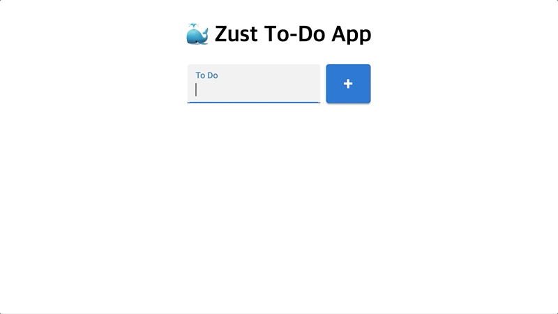

# Zust To-Do App

📎 [Demo](https://fromnowwon.github.io/zust-todo-app/)



<br/>

## Introduction
- 할 일을 간단하게 정리해둘 수 있는 애플리케이션입니다.
- Local storage에 저장되기 때문에 새로고침이나 브라우저를 닫았다 열어도 기록이 남아 있습니다.

<br/>

## Tech Stack
- Client: React, TypeScript, Zustand, Emotion, Material UI

<br/>

## Tree
```
zus-todo-app
├── public
│   ├── images (이미지 관리)
│   └── index.html
├── src
│   ├── App.tsx
│   ├── App.styles.ts (App 컴포넌트 스타일 - Emotion)
│   ├── Todo
│   │   ├── Sections
│   │   │   ├── Add.tsx (리스트 추가)
│   │   │   └── TodoList.tsx (리스트)
│   │   └── Todo.tsx (To-Do 리스트)
│   ├── store.tsx (전역 State 관리 - Zustand Store)
│   ├── index.tsx
│   └── react-app-env.d.ts
├── README.md
├── package-lock.json
├── package.json
└── tsconfig.json
```
